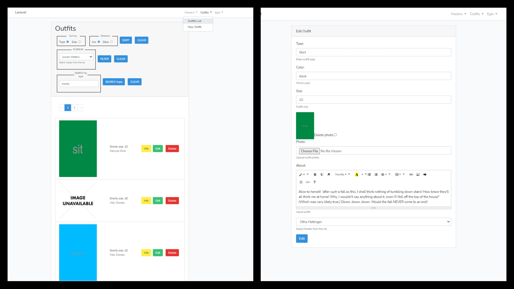

## Educational lecture project "Mada Lara"
Basic project done during lectures following the lecturer.
Built with Laravel.

## Features:
- Login/logout (only authorized users. Not possibile to register)
- Add, edit or delete outfits
- Add, edit or remove masters (designers)
- Relational MySQL database: assign outfits to specific masters
- Search by outfit type
- Filter by designer responsible
- Sort outfits by size or by type, ascending or descending order
- Get pdf
- See info
- WYSIWYG editor for descriptions
- Add pictures
- Faker used for data seeding
- Paginator

